### Principle:

It was in 1901, that Austrian-American immunologist and pathologist Karl Landsteiner discovered human blood groups. Karl Landsteiner's work helps to determine blood groups and thus opened a  way for blood transfusions  which can be  carried out safely.  He was awarded the Nobel Prize in Physiology or Medicine in 1930 for this discovery.

 

Death of the patient was the result in most cases before 1900, when blood transfusion was attempted. Blood transfusion was made much safer by the discovery of blood groups, as blood of the same ABO group could be chosen for each patient. However, there were still many cases of unexplained blood transfusion reactions. Biologists still went in search of these unexplained questions.

 

In 1902, the fourth main type, AB was found by Decastrello and Sturli. It was the observations of Levine and Stetson in 1939, and Landsteiner and Weiner in 1940, that laid the foundations of our knowledge about the remaining major blood group- the Rhesus system. Once reliable tests for Rhesus grouping had been established, transfusion reactions became rare! For this discovery Landsteiner was awarded the Nobel Prize in Physiology or Medicine in 1930.

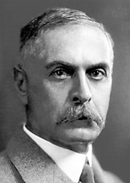

### The Components of Blood
 

The circulatory system distributes about 4-6 liters of blood to the adult human body. The blood mainly has 2 portions: the Plasma and the Blood Cells. Plasma is mainly  composed of water, but contains different types of  proteins and other chemicals such as: enzymes, glucose, fat particles, salts ,hormones , antibodies etc. It constitutes about 60% of the blood. Blood cells can be observed under a microscope on staining.  The formation of blood cells occur in the bone marrow by the 'Hematopoietic stem cells'. They can be divided into 3 basic cell types:

 

### Erythrocytes- Red Blood Cells (RBC):
 

As the name suggests, these red coloured cells give blood its red colour. (The word erythrocyte is from erythro-Gk.meaning red and Latin-cytos meaning cell.)  1 ml of blood contains approximately 5 million RBCs! The proportion of blood occupied by red blood cells is referred to as the hematocrit, and is normally about 45%. Mature RBCs are biconcave in shape, lack a Nucleus and many other organelles. They circulate in the system for about 120 days, carrying out their job, i.e., to supply oxygen.

This function is carried out by them most efficiently. since they are rich in an Iron-containing biomolecule called haemoglobin. Haemoglobin has high affinity for oxygen, thus binds to it and is transported from the alveoli (in lungs) to every part of the body. There is constant replenishment of RBCs in order to remove old cells that break down. (This process is carried out in organs like the liver, also producing by-products like bile pigments.) Millions of cels  are released into the bloodstream from the bone marrow each day.

### Leukocytes- White Blood Cells:
 

These cells are key players in our immune system. They are of different types such as neutrophils, lymphocytes, eosinophils, monocytes, basophils.  Each of them have a variety of functions in our immunity. 1 ml of blood of an adult human contains about 4,000-11,000 leukocytes. Basically, they destroy and remove old or aberrant cells and clear cellular debris, as well as attack foreign substances and infectious agents (pathogenic entities).

 

### Thrombocytes- Platelets:
 

The  coagulation or blood clotting process is taken care of by them. They act on clotting proteins like Fibrinogen, converting it into Fibrin. They create a mesh onto which RBCs collect and form a clot. This prevents excessive blood loss and also checks the entry of pathogens into the body. 1 ml of blood of an adult human contains about 200,000-500,000 platelets.

 
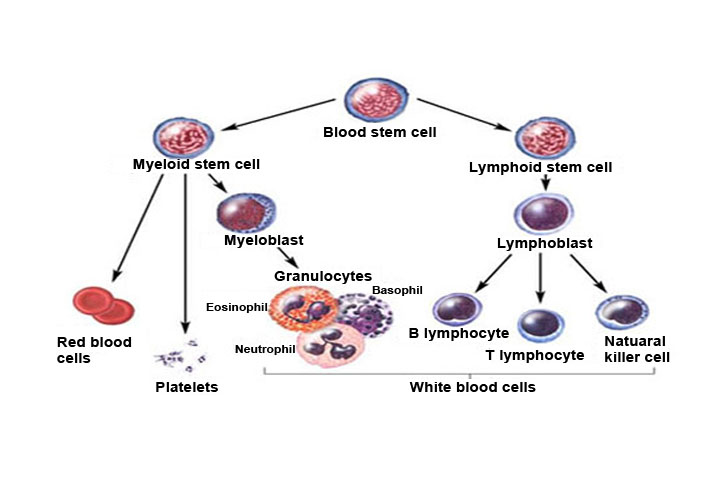

### The observations that led to the discovery of blood groups:
 

At times, it was observed that mixing blood from two individuals led to blood clumping or agglutination. Later it was understood that the agglutinated red cells can clog blood vessels and stop the circulation of the blood to various parts of the body. The agglutinated red blood cells also crack and their contents leak out in the body.

 

The RBCs contain haemoglobin which becomes toxic when outside the cell. This must have been the phenomena that occurred in the blood transfusion cases that ended up with fatality of the patient at the receiving end. Karl Landsteiner discovered that blood clumping was an immunological reaction which occurs when the receiver of a blood transfusion has antibodies against the donor blood cells! People learned that, compatibility of blood groups needed to be checked before anything else was done. If they are not, the red blood cells from the donated blood will agglutinate. This can have fatal consequences for the patient.

 

### ABO blood grouping system:
 

According to the AB0 blood group system there are four different kinds of blood groups: **A, B, AB and O (null)** .

 

### Blood group A

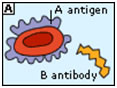
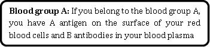

 

### Blood group B
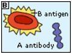
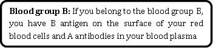

 

### Blood group AB
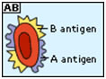
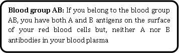

 

### Blood group O
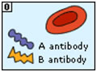
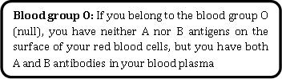

 

### Rh factor
 
 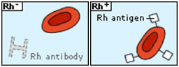

Rh (Rhesus) factor is found on the RBC's surface in most people. Like A and B, this is also an antigen and those who have it are called Rh+. Those who lack the antigen on the surface of RBCs are called Rh-. A person with Rh- blood does not have Rh antibodies naturally in the blood plasma. But a person with Rh- blood can develop Rh antibodies in the blood plasma if he or she receives blood from a person with Rh+ blood, whose Rh antigens can trigger the production of Rh antibodies (as the immune system is triggered by the presence of an unknown antigen in the system). A person with Rh+ blood can receive blood from a person with Rh- blood without any problems.

 

 

### Inheritance of Blood Groups:
 

Blood groups for each individual are determined by genes or alleles (small packets of information in cells contained in the DNA) which are inherited from both parents. Genes for the Rh-ve and O groups from one parent are masked (i.e., they are recessive) by the presence of Rh+ve and A or B genes from the other parent. That is, O and Rh negative genes only produce an effect when there is a "double dose" of such genes, i.e., one from each parent (homozygous condition). Thus, people who are apparently A or B Rh+ve may also carry genes for the O and Rh-ve blood groups which can be inherited by their children.

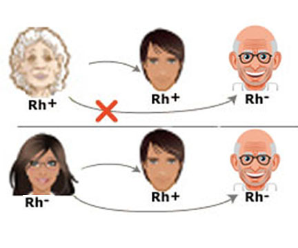

 

### Principle behind blood tests: Blood clumping or Agglutination observation.
 

Compatibility between the blood groups of donor and recipient determines the success of a blood transfusion. The AB0 and Rh blood groups are looked at while conducting the test. In a diagnostic lab, Monoclonal antibodies are available for A, B and Rh antigen. Monoclonal antibody against Antigen A (also called Anti-A), comes in a small bottles with droppers; the monoclonal suspension being BLUE in colour. Anti-B comes in YELLOW colour. Anti-D (monoclonal antibody against Rh) is colourless. All the colour codes are universal standards. When the monoclonal antibodies are added one by one to wells that contain the test sample (blood from patient), if the RBCs in that particular sample carry the corresponding Antigen, clumps can be observed in the corresponding wells. A drop of blood is left without adding any of the antibodies; it is used as a control in the experiment. The monoclonal antibody bottles should be stored in a refrigerator. It is recommended to tilt the bottle a couple of times before use in order to resuspend the antibodies that have settled at the bottom of the bottle.

 
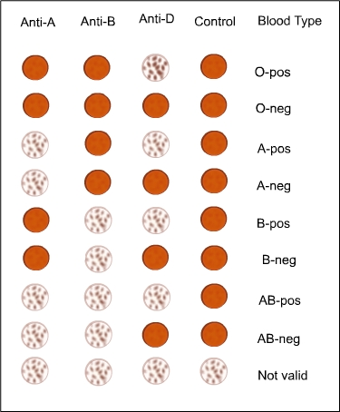
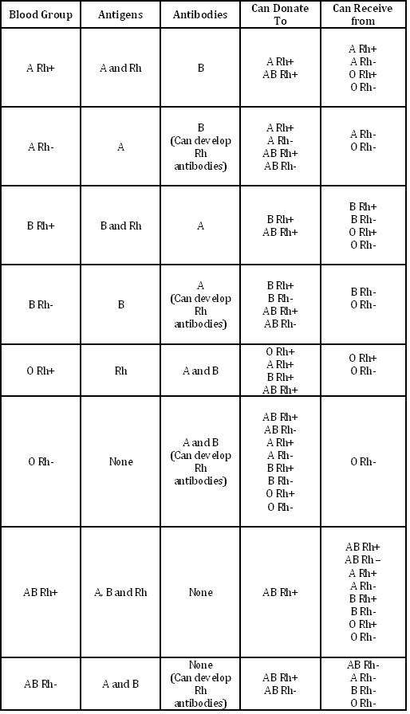

 

Image Courtesy :- http://nobelprize.org/nobel_prizes/medicine/laureates/1930/landsteiner.jpg
